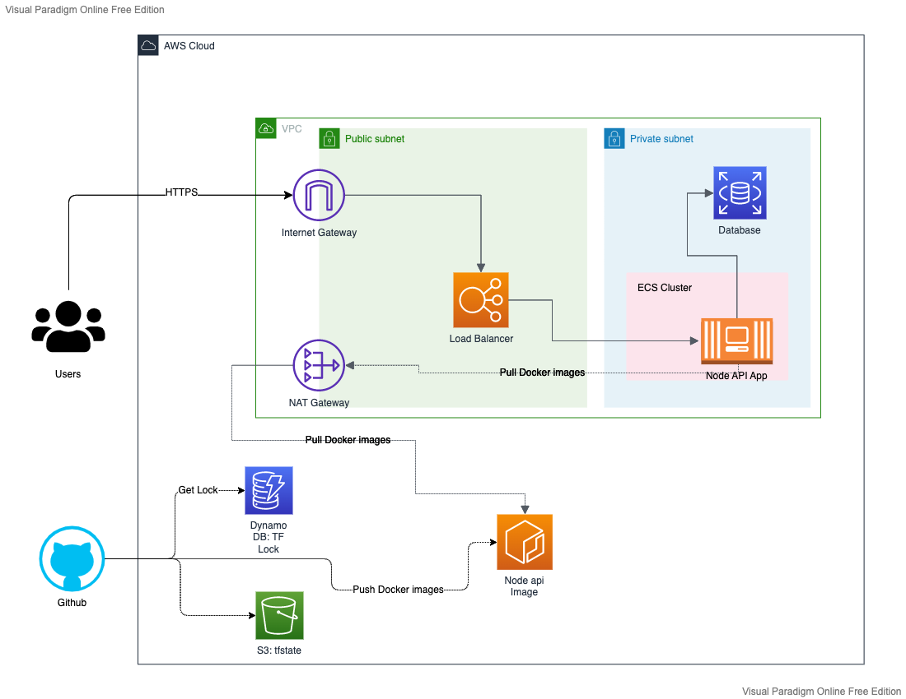

# Node API – Docker Terraform AWS



## Local development

Run terraform with Docker Compose:

```
docker-compose -f deploy/docker-compose.yml run --rm terraform init
docker-compose -f deploy/docker-compose.yml run --rm terraform fmt
docker-compose -f deploy/docker-compose.yml run --rm terraform validate
docker-compose -f deploy/docker-compose.yml run --rm terraform plan
docker-compose -f deploy/docker-compose.yml run --rm terraform apply
```

etc...
